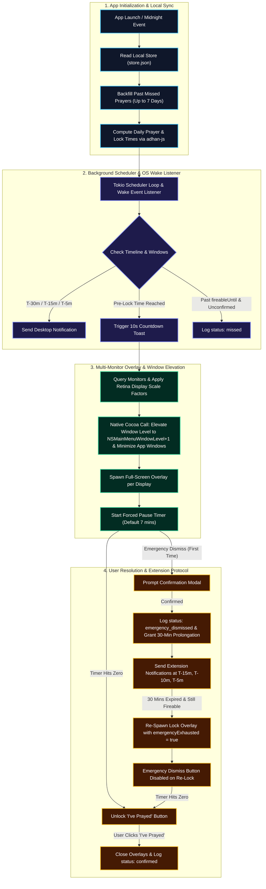

# Waqt 🕌

[](https://tauri.app/)
[](https://www.rust-lang.org/)
[](https://react.dev/)
[](https://www.typescriptlang.org/)
[](https://tailwindcss.com/)
[](LICENSE)

> **Waqt** is a minimalist, privacy-first personal accountability desktop application designed to interrupt work smoothly at prayer times, enforce a brief forced pause, and foster consistent prayer habits without trapping the user.

---

## 🌟 Overview & Philosophy

Waqt operates on a simple principle: **personal accountability, not surveillance or punishment**. 

* **Honor System Only**: The application does not monitor your camera, log keypresses, block system inputs, or act as an OS-level lock screen.
* **Pre-Lock Lead Time Offset (`preLockMinutes`)**: Configure a custom lead time (0 to 30 minutes, default 15 minutes) prior to prayer time to gracefully disengage from computer tasks early.
* **Forced Pause Friction**: At prayer lock time, a full-screen overlay appears with a configurable forced pause duration (default 7 minutes). During this window, the *"I've prayed"* confirmation button is present but disabled, giving you space to disengage.
* **Emergency Dismiss Prolongation & Strict Re-Lock Protocol**: Triggering emergency dismiss temporarily snoozes the lock screen by 30 minutes while sending desktop reminders at T-15m, T-10m, and T-5m. If the prayer window is still active after 30 minutes, Waqt re-locks the screen with `emergencyExhausted = true`, disabling emergency dismiss to prevent abuse while respecting true emergencies.
* **100% Offline & Private**: All prayer times are calculated client-side using `adhan-js` based on your coordinates and preferred calculation method. All settings and history logs remain strictly local on your device (`~/Library/Application Support/waqt/store.json`). Zero cloud telemetry, tracking, or network calls.

---

## 📐 System Design & Execution Flow

Below is the architectural workflow showing how **Waqt** computes schedules, handles notifications, manages emergency prolongations, spawns multi-monitor overlays, and processes user responses:



---

## ✨ Features

- **Offline Prayer Calculations**: Accurately computes Fajr, Dhuhr, Asr, Maghrib, and Isha times locally across 12 calculation methods (MWL, ISNA, Umm Al-Qura, Egyptian, Karachi, Dubai, Moonsighting Committee, North America, Kuwait, Qatar, Singapore, Turkey, Tehran) and Asr schools (Standard / Hanafi).
- **Configurable Pre-Lock Lead Time (`preLockMinutes`)**: Configure a pre-lock lead time (0–30 minutes, default 15 mins) before official prayer times to help disengage early.
- **Pre-Prayer Notifications**: Timely desktop reminders delivered at **T-30m**, **T-15m**, and **T-5m** before prayer lock.
- **10-Second Countdown Toast**: Non-intrusive corner toast with chime support notifying you 10 seconds before the overlay activates.
- **Multi-Monitor Overlay & Native Window Elevation**: Full-screen overlay spawned across all connected displays with physical-to-logical Retina pixel scaling, native macOS window level elevation (`NSMainMenuWindowLevel + 1`), and automatic app window minimization.
- **Emergency Extension & Strict Re-Lock Protocol**: Emergency dismissal grants a 30-minute delay with reminders at 15m, 10m, and 5m. After 30 minutes, Waqt re-locks the screen with `emergencyExhausted = true`, disabling emergency dismiss on re-lock to prevent perpetual shortcuts.
- **Automated 7-Day Missed Prayer Backfill**: Automatically scans and backfills missed prayer entries for unconfirmed windows up to 7 days retroactively.
- **Sleep & Wake Recovery**: Evaluates OS wake events to trigger or skip overlays seamlessly based on active prayer boundaries.
- **Onboarding OS Permissions Wizard**: 4-step setup wizard with live permission checking and guidance for Notifications, Autostart, and macOS Accessibility.
- **Single Instance & Background Daemon**: Managed by `tauri-plugin-single-instance` and a Rust Tokio interval scheduler running continuously in the background.
- **Developer Environment Guarding**: Test reminders and debug tools strictly isolated behind development environment checks.

---

## 🛠 Tech Stack

- **Desktop Framework**: [Tauri v2](https://tauri.app/) (Rust backend + Webview frontend)
- **Frontend UI**: React 18, TypeScript, Vite
- **Styling**: Tailwind CSS (Dark aesthetic, modern glassmorphism, micro-animations)
- **Calculation Library**: `adhan` (npm package)
- **State & Storage**: Tauri Store (`tauri-plugin-store`) saving local JSON
- **OS Plugins & Integrations**: `tauri-plugin-notification`, `tauri-plugin-autostart`, `tauri-plugin-single-instance`, Cocoa / Objective-C native FFI (macOS window hardening)
- **Background Scheduler**: Tokio interval loop in Rust (`src-tauri`)

---

## 📁 Repository Structure

```
waqt/
├── AGENTS.md                  # Developer & AI agent steering guidelines
├── PRD.md                     # Product Requirements Document
├── TASKS.md                   # Feature implementation roadmap
├── package.json               # Node.js dependencies & frontend scripts
├── vite.config.ts             # Vite build configuration for Tauri
├── src-tauri/                 # Rust Backend (Tauri v2)
│   ├── Cargo.toml             # Rust dependencies (tauri, tokio, serde, etc.)
│   ├── tauri.conf.json        # Tauri app configuration & window settings
│   └── src/
│       ├── main.rs            # Rust entrypoint & Tauri command registration
│       ├── lib.rs             # Tauri setup & plugin initializations
│       ├── scheduler.rs       # Tokio background interval, missed prayer backfill & wake listener
│       ├── store.rs           # Local JSON state management wrapper
│       └── overlay_window.rs  # Multi-monitor borderless overlay & macOS window level elevation
└── src/                       # React Frontend
    ├── main.tsx               # React application root
    ├── App.tsx                # Context router & view switcher
    ├── index.css              # Global design tokens, Tailwind directives & dark theme
    ├── types/                 # TypeScript type definitions
    ├── lib/
    │   ├── adhanCalc.ts       # adhan-js wrapper & calculation utilities
    │   └── store.ts           # Tauri store & IPC synchronization wrapper
    └── screens/
        ├── Onboarding/        # Setup wizard (Location, Method, Pre-Lock, Pause, OS Permissions)
        ├── Dashboard/         # Today's 5 prayer times & live countdown
        ├── Settings/          # User preferences & calculation configuration
        ├── Log/               # Prayer log history table
        ├── CountdownToast/    # 10s bottom-right countdown toast
        └── Overlay/           # Full-screen forced-pause lock overlay & emergency re-lock state
```

---

## 🚀 Getting Started

### Prerequisites

Ensure you have the following installed on your system:

- [Node.js](https://nodejs.org/) (v18 or higher)
- [Rust](https://www.rust-lang.org/tools/install) (latest stable toolchain)
- Platform build essentials:
  - **macOS**: Xcode Command Line Tools (`xcode-select --install`)
  - **Linux**: `build-essential`, `libssl-dev`, `libgtk-3-dev`, `libwebkit2gtk-4.1-dev`, `libappindicator3-dev`
  - **Windows**: C++ Build Tools or Visual Studio

### Installation

1. **Clone the repository:**
   ```bash
   git clone https://github.com/NureniJamiu/waqt.git
   cd waqt
   ```

2. **Install frontend dependencies:**
   ```bash
   npm install
   ```

3. **Run in Development Mode:**
   ```bash
   npm run tauri dev
   ```
   This will start the Vite dev server and launch the Tauri desktop application with hot-reloading.

4. **Build for Production:**
   ```bash
   npm run tauri build
   ```
   The compiled executable and installer bundles will be generated in `src-tauri/target/release/bundle/`.

---

## 🔒 Data & Privacy Model

Waqt stores all configuration settings, emergency extensions, and logs in a single local JSON file (`~/Library/Application Support/waqt/store.json` on macOS).

```json
{
  "settings": {
    "latitude": 6.5244,
    "longitude": 3.3792,
    "cityName": "Lagos, Nigeria",
    "calculationMethod": "MuslimWorldLeague",
    "asrSchool": "Standard",
    "forcedPauseSeconds": 420,
    "preLockMinutes": 15,
    "soundEnabled": true,
    "snoozeEnabled": false,
    "notificationsEnabled": true,
    "launchAtLogin": true,
    "onboardingCompleted": true,
    "created_at": "2026-08-17"
  },
  "log": [
    {
      "id": "1723900000000-Dhuhr",
      "date": "2026-08-17",
      "prayer": "Dhuhr",
      "scheduledTime": "2026-08-17T13:02:00+01:00",
      "status": "confirmed",
      "confirmedAt": "2026-08-17T13:09:14+01:00"
    }
  ],
  "emergency_extensions": [
    {
      "id": "ext-1723900000000",
      "date": "2026-08-17",
      "prayer": "Asr",
      "dismissedAt": "2026-08-17T16:15:00+01:00",
      "expiresAt": "2026-08-17T16:45:00+01:00",
      "notified15m": true,
      "notified10m": true,
      "notified5m": true,
      "relocked": true
    }
  ]
}
```

*Status Enum Values:* `confirmed` | `emergency_dismissed` | `missed`

---

## 📜 License

This project is licensed under the [MIT License](LICENSE).

