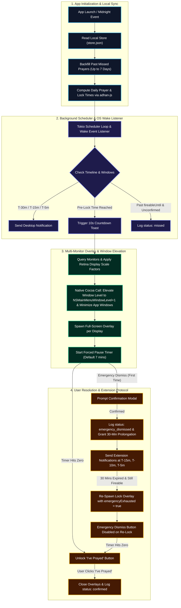

# Waqt

[](https://tauri.app/)
[](https://www.rust-lang.org/)
[](https://react.dev/)
[](https://www.typescriptlang.org/)
[](https://tailwindcss.com/)
[](LICENSE)

> **Waqt** is a minimalist, privacy-first personal accountability desktop application built to smoothly interrupt work sessions at prayer times, enforce a brief forced pause, and encourage consistent daily habits while keeping you in full control.

---

## How It Works

Here is how Waqt fits seamlessly into your daily workflow to help you stay accountable without disruption:

1. **Background Schedule Calculation**:
   When you launch Waqt or when midnight strikes, the app calculates your exact daily prayer times locally using your location and preferred calculation method. It schedules desktop notifications at **T-30m**, **T-15m**, and **T-5m**.

2. **The 10-Second Heads-Up**:
   When prayer time arrives (T-0), Waqt displays a subtle 10-second countdown toast in the bottom-right corner of your screen, giving you a moment to wrap up your immediate task or save open files.

3. **Multi-Monitor Forced Pause**:
   Once the countdown ends, full-screen lock overlays spawn seamlessly across all connected monitors. The screen enforces a brief, configurable pause (e.g., 7 minutes). The "I've Prayed" button remains disabled until the timer reaches zero, creating friction-free time to step away and pray.

4. **Resolution or Emergency Prolongation**:
   * **Completing Prayer**: After the timer completes, click **"I've Prayed"** to instantly unlock your screen and log the prayer as confirmed.
   * **Real Emergency**: If an urgent situation arises, click **Emergency Dismiss** to immediately unlock your screens and log `emergency_dismissed`. This grants a single 30-minute delay with reminder toasts before automatically re-locking your screen so you don't lose track of time.

5. **Automatic Offline Backfill**:
   If your computer was asleep or closed during a prayer window, Waqt automatically reconciles unconfirmed prayers retroactively for up to 7 days upon waking up.

---

## Key Features

* **Native Multi-Monitor Overlay Hardening**: Spawns physical borderless lock screens across all connected monitors using macOS Objective-C Cocoa FFI (`NSMainMenuWindowLevel + 1`) and Win32 extended window styles (`HWND_TOPMOST`, `WS_EX_TOOLWINDOW`) on Windows.
* **Fail-Safe Honor System & Re-Lock Protocol**: Enforces a configurable pause (default 7 mins). Emergency dismissal grants a single 30-minute delay with reminders at T-15m, T-10m, and T-5m, automatically re-locking with `emergencyExhausted = true` to prevent perpetual shortcuts.
* **Continuous Background Tokio Daemon**: Runs continuously in Rust, independently monitoring time, system sleep/wake events, and mid-day timezone/DST shifts (`Local::now().offset()`) to immediately recalculate schedules.
* **Offline & Zero-Telemetry Privacy**: Calculates prayer times client-side using `adhan-js` across 12 calculation methods and Asr schools. All settings and history logs remain strictly local (`~/Library/Application Support/waqt/store.json`).
* **Automated 7-Day Backfill**: Automatically reconciles unconfirmed prayer windows retroactively up to 7 days upon app launch or OS wake.
* **Automated Auto-Updater & Gatekeeper Compliance**: Includes built-in background update engine with cryptographic signature verification (`tauri-plugin-updater`) and Apple Developer ID notarization via GitHub Actions CI.

---

## System Design

Below is the architectural workflow showing how **Waqt** computes schedules, handles notifications, manages emergency prolongations, spawns multi-monitor overlays, and processes user responses:



---

## Tech Stack

* **Desktop Core**: [Tauri v2](https://tauri.app/) (Rust backend + Webview frontend)
* **Frontend Engine**: React 18, TypeScript, Vite, Tailwind CSS
* **Native OS Interop**: Objective-C / Cocoa AppKit FFI (macOS window level elevation), Win32 API (`windows-sys` crate)
* **Computation & State**: `adhan-js`, `tauri-plugin-store` (local JSON store), Rust Tokio async runtime

---

## Repository Structure

```
waqt/
├── AGENTS.md                  # Developer & AI agent steering guidelines
├── TASKS.md                   # Feature implementation roadmap
├── package.json               # Node.js dependencies & frontend scripts
├── vite.config.ts             # Vite build configuration for Tauri
├── src-tauri/                 # Rust Backend (Tauri v2)
│   ├── Cargo.toml             # Rust dependencies & crates
│   ├── tauri.conf.json        # Tauri app configuration & window settings
│   └── src/
│       ├── main.rs            # Rust entrypoint & Tauri command registration
│       ├── lib.rs             # Tauri setup & plugin initializations
│       ├── scheduler.rs       # Tokio background scheduler & wake listener
│       ├── store.rs           # Local JSON store wrapper
│       └── overlay_window.rs  # Multi-monitor borderless overlay & macOS elevation
└── src/                       # React Frontend
    ├── main.tsx               # React application root
    ├── App.tsx                # Context router & view switcher
    ├── index.css              # Global design tokens & dark theme
    ├── types/                 # TypeScript type definitions
    ├── lib/                   # Calculation wrappers & store sync
    └── screens/               # App views (Onboarding, Dashboard, Settings, Log, Overlay)
```

---

## Quickstart

### Prerequisites

* [Node.js](https://nodejs.org/) (v18+)
* [Rust](https://www.rust-lang.org/) (latest stable toolchain)

### Local Development

1. **Clone the repository:**
   ```bash
   git clone https://github.com/NureniJamiu/waqt.git
   cd waqt
   ```

2. **Install dependencies:**
   ```bash
   npm install
   ```

3. **Start development server:**
   ```bash
   npm run tauri dev
   ```

4. **Build release binary:**
   ```bash
   npm run tauri build
   ```

---

## Release Pipeline, Code Signing & Auto-Updater

Waqt includes an automated production release pipeline via GitHub Actions (`.github/workflows/release.yml`):

* **Apple Developer Code Signing & Notarization**: Automatically signs `.app` and `.dmg` binaries with your Apple Developer ID Certificate and submits them to Apple's Notary Service via `notarytool` to ensure Gatekeeper compliance without warning prompts.
* **Auto-Updater with `tauri-plugin-updater`**: Generates signed update manifests (`latest.json`) and bundles (`.app.tar.gz`, `.sig`) uploaded to GitHub Releases for seamless, secure background app updates.

### Required GitHub CI Secrets
To configure automatic code signing and releases, add these secrets under **Settings -> Secrets and variables -> Actions**:
* `APPLE_CERTIFICATE`: Base64-encoded Apple Developer `.p12` certificate.
* `APPLE_CERTIFICATE_PASSWORD`: Password for the `.p12` certificate.
* `APPLE_TEAM_ID`: 10-character Apple Developer Team ID.
* `APPLE_ID`: Apple ID email address.
* `APPLE_PASSWORD`: App-specific password generated at [appleid.apple.com](https://appleid.apple.com).
* `TAURI_SIGNING_PRIVATE_KEY`: Private key generated via `tauri signer generate`.
* `TAURI_SIGNING_PRIVATE_KEY_PASSWORD`: Password for the Tauri signing key.

---

## Future Roadmap

Waqt is evolving from a specialized prayer tracker into a universal **Ergonomic Work-Break & Screen Pause Enforcer** for long sitters and desk workers.

### Planned Evolution
* **Universal Break Enforcement**: Introduce mandatory break schedules for sedentary work (e.g. 5-minute movement break every 50 minutes of computer activity).
* **Flexible Onboarding Preferences**: Add an onboarding toggle: *"Are you a Muslim and would like to enable prayer time tracking and enforcement?"*
  * **If enabled**: Maintains full v1 prayer schedule calculations alongside customizable break intervals.
  * **If disabled**: Functions strictly as a customizable work-break enforcer with user-defined pause durations and lock schedules.
* **Custom Break Timing**: Allow users to configure multiple custom break intervals throughout their workday while keeping the same non-bypassable forced pause mechanics.

---

## Technical Article (Coming Soon)

A comprehensive deep-dive article will be published soon covering:
* **Motivation & Philosophy**: Why Waqt was built and how the unbreakable honor system works.
* **Plain-English Mechanics**: How schedule calculations, forced pause friction, and emergency prolongations function under the hood.
* **Architecture & Native Hardening**: Multi-monitor window elevation (`NSMainMenuWindowLevel + 1` Cocoa FFI and Win32 `HWND_TOPMOST`), dynamic scale factors, and physical-to-logical pixel mappings.
* **Edge Cases & Resilience**: Handling OS sleep/wake recovery, mid-day timezone and DST shifts, and retroactive 7-day missed prayer backfills.
* **Engineering Trade-offs**: Lessons learned building an offline-first desktop app with Rust and Tauri v2.

---

## License

This project is licensed under the [MIT License](LICENSE).


